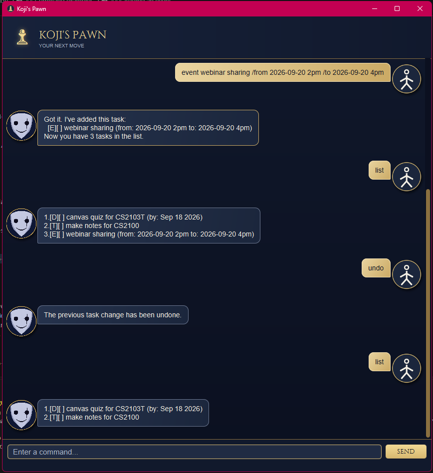

# Koji's Pawn User Guide

Koji's Pawn is a task-management chatbot with a JavaFX chat window and a console interface. It manages todos,
deadlines, and events, saves task changes between sessions, and lets you search tasks or undo your most recent change.



## Getting started

Use JDK 25 and run commands from the project directory so the task file is saved in the expected location.
To open the JavaFX chat window, run `Launcher.main()` in your IDE or use Gradle:

```powershell
.\gradlew.bat run
```

On macOS or Linux, use `./gradlew run`. To use the console instead, run `KojisPawn.main()` in your IDE.
In the chat window, type a command and press Enter or select **SEND**. The conversation scrolls to the latest message.
Both interfaces understand the same commands and use the same task file.

## Command reference

Enter one command at a time. Command words must be lowercase. Uppercase words such as `DESCRIPTION` and
`TASK_NUMBER` are placeholders to replace with your own values. Extra spaces around commands are allowed.

| Command | What it does | What to enter |
|---|---|---|
| `todo` | Adds a task without a date or time. | `todo DESCRIPTION` |
| `deadline` | Adds a task that must be completed by a date. The date must use `yyyy-MM-dd`. | `deadline DESCRIPTION /by yyyy-MM-dd` |
| `event` | Adds an event with a start and end. See [Event dates and times](#event-dates-and-times) for validation rules. | `event DESCRIPTION /from START /to END` |
| `list` | Displays all tasks and their task numbers. | `list` |
| `mark` | Marks the selected task as completed. | `mark TASK_NUMBER` |
| `unmark` | Marks the selected task as incomplete again. | `unmark TASK_NUMBER` |
| `delete` | Removes the selected task from the list. | `delete TASK_NUMBER` |
| `undo` | Reverses the most recent successful add, mark, unmark, or delete. | `undo` |
| `on` | Displays deadlines occurring on a specified date. Todos and events are not included. | `on yyyy-MM-dd` |
| `find` | Displays tasks whose descriptions contain a keyword. | `find KEYWORD` |
| `bye` | Exits the chatbot. Task changes have already been saved automatically. | `bye` |

## Command examples

### Adding a todo

```text
todo make notes for CSxxxx
```

### Adding a deadline

Deadline dates must use `yyyy-MM-dd`. Although the date is entered as `2026-09-18`, it is displayed as `Sep 18 2026`.

```text
deadline canvas quiz for CSxxxx /by 2026-09-18
```

### Adding an event

```text
event webinar sharing /from Friday 2pm /to 4pm
```

You can also enter calendar dates:

```text
event webinar sharing /from 2026-09-20 2pm /to 2026-09-20 4pm
```

### Event dates and times

The `/from` and `/to` markers are required, must occur in that order, and may each appear only once. Event values
can be free-form text such as `Monday 2pm` or `4pm`. When a value begins with `yyyy-MM-dd`, Koji's Pawn checks that
it is a real calendar date. A time or other text may follow the date after a space. If both values begin with dates,
the end date must be the same as or later than the start date. For example, this command is rejected:

```text
event webinar sharing /from 2026-09-21 /to 2026-09-20
```

Free-form times are not compared with each other. Events are stored as text, so `on` searches deadlines only,
even when an event contains a date.

### Listing tasks

```text
list
```

### Marking, unmarking, deleting, and undoing tasks

Use the number displayed by `list`. Task numbering starts at `1`.

```text
mark 2
unmark 2
delete 2
```

`undo` restores the task list to its state before the last successful change and saves that restored state. It can
undo one change at a time; another successful change replaces the previous undo opportunity. Read-only commands
such as `list` and failed commands do not replace it.

```text
todo make notes
undo
```

### Finding deadlines by date

```text
on 2026-09-18
```

If no deadline occurs on that date, Koji's Pawn reports that no dated tasks were found. The query date must be a
real date in `yyyy-MM-dd` format.

### Finding tasks by description

```text
find notes
```

The search is case-sensitive and checks only task descriptions.

### Exiting the chatbot

```text
bye
```

The console also exits cleanly when its input stream ends. In the JavaFX chat, `bye` displays Koji's farewell
briefly before closing the window.

## Task symbols

| Symbol | Meaning |
|---|---|
| `[T]` | Todo |
| `[D]` | Deadline |
| `[E]` | Event |
| `[X]` | Completed |
| `[ ]` | Incomplete |

For example, a completed deadline is displayed as:

```text
[D][X] Canvas quiz (by: Sep 18 2026)
```

## Saving tasks

Tasks are saved automatically after an add, mark, unmark, delete, or undo command. They are loaded again when
Koji's Pawn starts. The data is stored locally at:

```text
data/kojispawn.txt
```

You do not need to edit this file manually. If it does not exist, Koji's Pawn starts with an empty list.

## Input and storage errors

Koji's Pawn explains missing command values, invalid task numbers, impossible dates, repeated `/by`, `/from`, or
`/to` markers, and other invalid commands without adding a task. Task text cannot contain the reserved separator
` | ` or a line break because those would damage the saved-data format. Leading, trailing, and repeated spaces
between ordinary command parts are accepted.

If saving fails, Koji's Pawn reports the error and keeps the current task list and undo history so you can retry.
If saved data cannot be loaded, the JavaFX interface displays the storage error in an alert. Malformed saved records
report their file and line number; the data file is left in place for you to inspect or repair.
